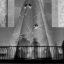
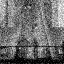
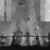
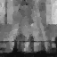
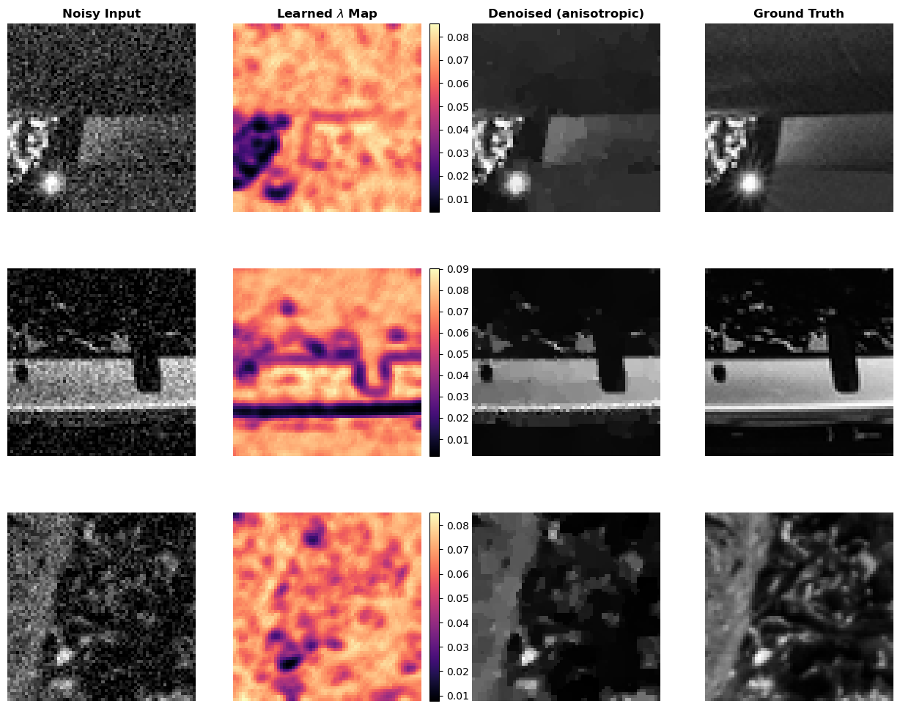

# Diff-TV-Net

A PyTorch implementation of **Differentiable Total Variation Denoising** using `cvxpylayers`. 
`cvxpylayers` is a package developed by Akshay Agrawal & al and introduced in "Differentiable Convex Optimization Layers". It allows for DPP convex problems to be fully integrated into a NeuralNetwork layer and allows for backpropagation. It also performs the canonicalization internally.

This project integrates classic convex optimization into a deep learning pipeline to learn spatially-adaptive regularization parameters. By leveraging the **Implicit Function Theorem** on the KKT conditions, the network backpropagates through the optimization solver to update a CNN that predicts the optimal $\Lambda$ (lambda) map for any given noisy input.

---

## Technicalities on training and inference.

The model is designed as a hybrid system to optimize performance on **Apple Silicon (M4 Pro)**:
* **Weight Predictor (GPU/MPS):** A CNN processed on the Metal Performance Shaders (MPS) backend to predict the regularization map.
* **Optimization Layer (CPU):** A `CvxpyLayer` that solves the anisotropic TV proximal operator. Due to the lack of sparse tensor support in the MPS framework, this layer automatically handles data movement to the CPU and back to the GPU.

---

## Experiments & Progress

### Anisotropic TV on DIV2K
The initial experiment was conducted on the DIV2K dataset with a White additive Gaussian noise.
The model uses **SCS** (Splitting Conic Solver) with relaxed tolerances ($\epsilon = 1e-5$). It's a fast first order solver. We trained it on the train dataset of DIV2K for about 50 epochs.

#### Qualitative Results
Below is the visualization of the model's performance on a $64 \times 64$ patch from the validation set:

| Ground Truth | Noisy ($\sigma=25$) | **Diff-TV-Net (Learned $\Lambda$)** | **Regular SCS grid-search for $\lambda$** |
| :---: | :---: | :---: | :---: |
|  |  |  |  |

#### Observations
**Staircasing Artifacts:** The denoised output exhibits "staircasing," for both approaches where smooth intensity gradients are transformed into piecewise constant plateaus. This is a known characteristic of the Anisotropic Total Variation penalty. 

**Edge Preservation:** The power of this hybrid approach lies in the CNN's ability to predict a pixel-wise regularization map $\Lambda(x, y)$, rather than relying on a global scalar $\lambda$ obtained through cross-validation.

The following behaviors were observed in the learned $\Lambda$ maps during validation:

* **Contour Awareness**: The Weight Predictor identifies structural boundaries and predicts significantly lower $\lambda$ values (darker regions) along these edges. This "relaxes" the Total Variation penalty at discontinuities, allowing the solver to preserve sharpness.
* **Adaptive Smoothing**: In homogeneous regions, the network predicts higher $\lambda$ values (brighter orange/yellow), instructing the solver to apply an aggressive penalty to suppress Gaussian noise.
* **Anisotropic Sparsity**: Due to the $L_1$ nature of the anisotropic penalty, the learned maps exhibit a granular, feature-specific texture.

---

## Installation & Usage
1. Clone the repo.
2. Install requirements: `conda envn create -f env.yaml`.
